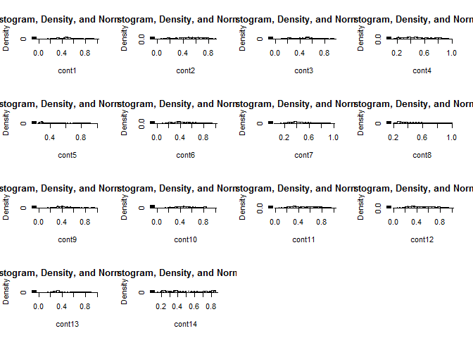
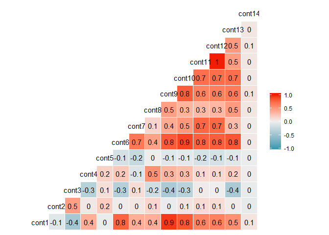
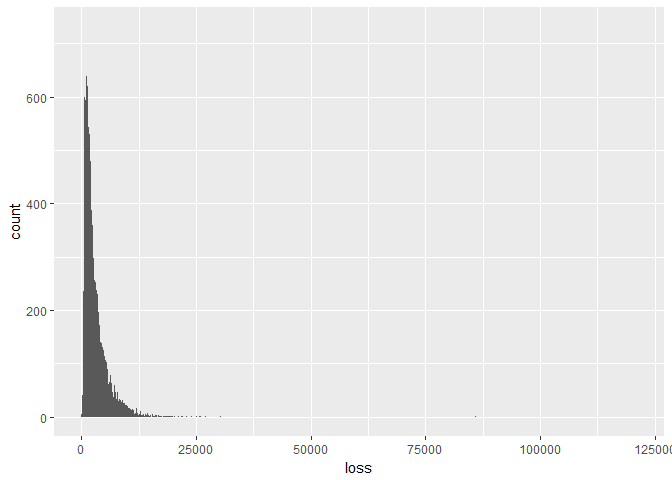
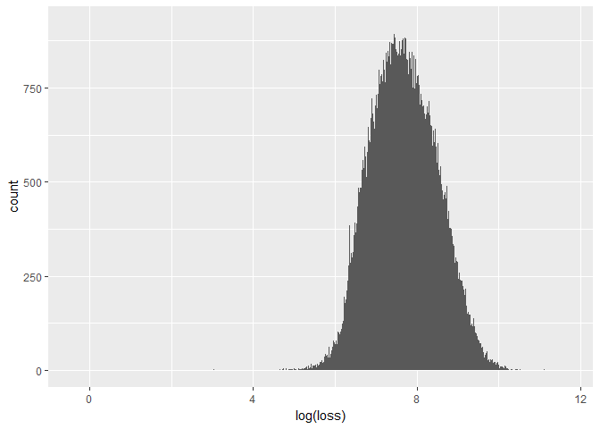
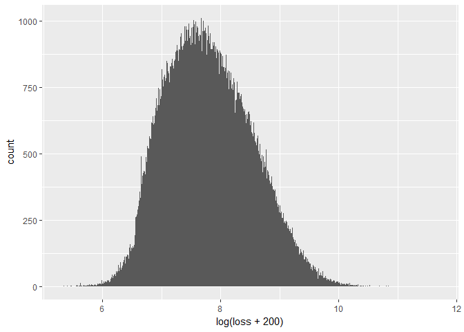

Allstate data overview
================
LipingLi
2016.12.23

### Important data

``` r
library(data.table)
train = fread("C:/data/train-allstate.csv", sep = ",", stringsAsFactors = T)
```

    ## 
    Read 42.5% of 188318 rows
    Read 74.3% of 188318 rows
    Read 188318 rows and 132 (of 132) columns from 0.065 GB file in 00:00:05

188318 rows and 132 columns. 116 categorical variables and 14 continous variables. The ture name of independent variables are unknown, thus we cannot engineer features by means of domain knowledge.

### Distribution of continuous variable

``` r
conts = train[, c(118:131), with = F]
library(psych)
multi.hist(conts)
```



These variables are standardized to 0-1 range, but not normally distributed.

``` r
library(ggplot2)
library(GGally)
ggcorr(conts, label = T)
```



``` r
rm(conts)  #to save space
```

Some variables are highly correlated to others. What about categorical variables?

### Correlations between categorical variables

``` r
# # This part runs for dozens of minutes, so I annotated it
#
# c=rep(1,(116*116))
# rec=matrix(c,nrow=116) #create a chi-square p-value matrix
# cat=train[,c(2:117),with=F] 
# cat=data.frame(cat) 
#
# # using for loop to get pairwise chi-square test
# for (i in 1:115)
# {
#     for (j in (i+1):116) 
#     {
#         rec[i,j]=chisq.test(cat[,i],cat[,j])$p.value 
#     } 
# }
# 
# for (i in 1:115) 
# {
#     for (j in (i+1):116)
#     {
#         if(rec[i,j]<=0.01)
#         cat('Chi-square test [cat',i,', cat',j,'] <0.01\n') 
#         # This if control flow can be inserted into chi-square test part, but I'm thinking to build functions supporting different p-level.
#     }
# } 
# rm(cat,rec,c,i,j) #remove non-necessaries to save space
```

A great number of categorical varibles are not independent from each other.

### Distribution of dependent variable

``` r
loss = train[, 132, with = F]
loss = data.frame(loss)
b = qplot(loss, data = loss, geom = "histogram", binwidth = 10)
b
```



Loss is not normally distributed. Since money issues often exponentially distributed, we can take log.

``` r
c = qplot(log(loss), data = loss, geom = "histogram", binwidth = 0.01)
c
```



Much better, but still have long-tail outliers. We can take a shift and log it.

``` r
d = qplot(log(loss + 200), data = loss, geom = "histogram", binwidth = 0.01)
d
```



Change the number for shift may result in even better normality. Here we adopt 200.
